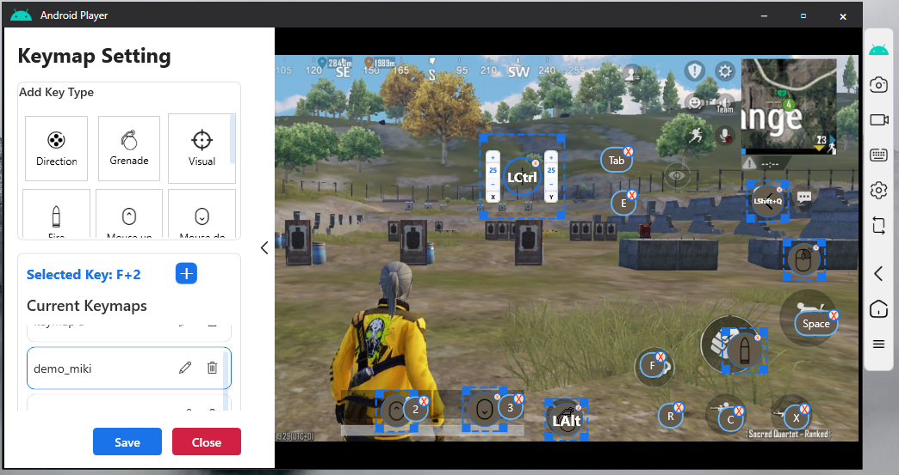

# AndroidPlayer

AndroidPlayer is a high-performance Android screen mirroring application for Windows built with WPF and DirectX. It provides low-latency video and audio streaming, keyboard and mouse control, and customizable key mapping for games and productivity.

---

## Features

- 🚀 Low-latency Android screen mirroring
- 🎮 Custom key mapping for games
- 🔊 Real-time Android audio forwarding
- ⌨️ Type directly on your Android device using your PC keyboard
- 🖱️ Mouse and keyboard control
- ⚡ GPU-accelerated H.264 decoding using FFmpeg
- 🖥️ DirectX rendering for smooth playback
- 📱 Works with Android devices over ADB

---

## Screenshots

### Screen Mirroring


### Key Mapping



---

## Building

### Requirements

- Windows 10 or later
- .NET SDK (see `global.json`)
- JetBrains Rider (recommended) or Visual Studio
- Android device with USB debugging enabled

### Build

Clone the repository:

```bash
git clone https://github.com/mikiboii/AndroidPlayer.git
```

Open the solution in **JetBrains Rider**:

```
Androidplayer.sln
```

Then either:

- Build and Run
- **or**
- Publish the project from Rider

No additional setup should be required if all project dependencies are present.

---

## Developer Mode

For easier testing while developing, enable Developer Mode inside the application.

Open:

```text
Androidplayer.Store.my_info
```

and set:

```csharp
private bool _developerMode = true;
```

Developer Mode enables features that simplify testing during development.

---

## Contributing

Contributions are welcome!

1. Fork the repository.
2. Create a new branch.
3. Make your changes.
4. Submit a Pull Request.

Please keep code style consistent and test changes before submitting.

---

## Technologies

- C#
- WPF
- DirectX 11
- FFmpeg.AutoGen
- ADB
- .NET

---

## License

This project is licensed under the Apache 2.0 License.

See the `LICENSE` file for details.