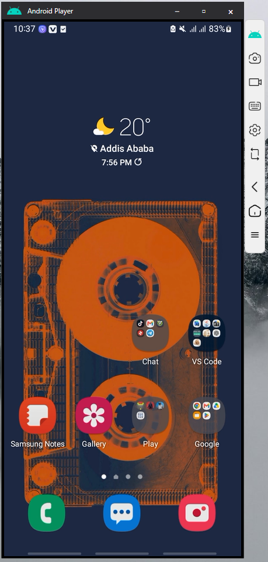

📱 AndroidPlayer
Real-time Android screen mirroring with PC control, audio forwarding, and keyboard input support

https://img.shields.io/badge/license-MIT-blue.svg
https://img.shields.io/badge/platform-Windows-blue
https://img.shields.io/badge/IDE-Rider-ff69b4

✨ Features
📺 High-Performance Mirroring - Real-time screen casting with low latency rendering

🎮 PC Control - Full mouse and keyboard control over your Android device

🔊 Audio Forwarding - Stream device audio directly to your PC speakers

⌨️ Text Input - Type directly from your PC keyboard into Android apps

🎯 Key Mapping - Customizable key bindings for enhanced control (see image 2)

⚡ Optimized Rendering - Smooth, high-quality display performance

https://Icons/Docs_image/image%25201.PNG

Figure 1: Real-time Android screen mirroring on PC

https://Icons/Docs_image/image%25202.PNG
Figure 2: Customizable key mapping interface

📥 Download
For regular users: Download the latest pre-built release from the Releases page. No building required - just download, extract, and run!

🚀 Quick Start (For Developers)
Prerequisites
Windows OS (7, 8, 10, or 11)

Android device with USB debugging enabled

Rider IDE or Visual Studio

Installation & Setup
Clone the repository

bash
git clone https://github.com/yourusername/AndroidPlayer.git
cd AndroidPlayer
Open in Rider

Launch Rider IDE

Open the solution file (AndroidPlayer.sln)

Build & Run

Click Build → Build Solution (or press Ctrl+Shift+B)

Click Run (or press Ctrl+F5)

Enable Developer Mode for Testing

⚠️ Important: For development and testing, ensure developer mode is enabled:

csharp
// In Androidplayer.Store.my_info
private bool _developerMode = true;  // Set to true for testing
Publishing
Use Rider's Build → Publish feature

Or run a standard build configuration

Ensure _developerMode is set to false before publishing

📋 System Requirements
Component	Requirement
OS	Windows 7, 8, 10, or 11
Storage	200MB free space
Android	7.0+ with USB debugging
Note: For end users, no IDE or development tools are required - just download the pre-built release!

💝 Support the Project
If you find AndroidPlayer useful and would like to support its development, consider making a donation:

https://img.shields.io/badge/Donate-PayPal-blue.svg

Your support helps keep the project alive and encourages continued development! Every contribution, no matter how small, is greatly appreciated. ❤️

📄 License
This project is licensed under the MIT License - see the LICENSE file for details.

🙏 Acknowledgments
Thanks to all contributors who help improve AndroidPlayer

Built with .NET and love for Android-PC integration

Star ⭐ this repository if you find it useful!

Report Bug · Request Feature

