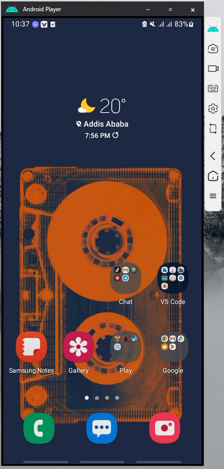
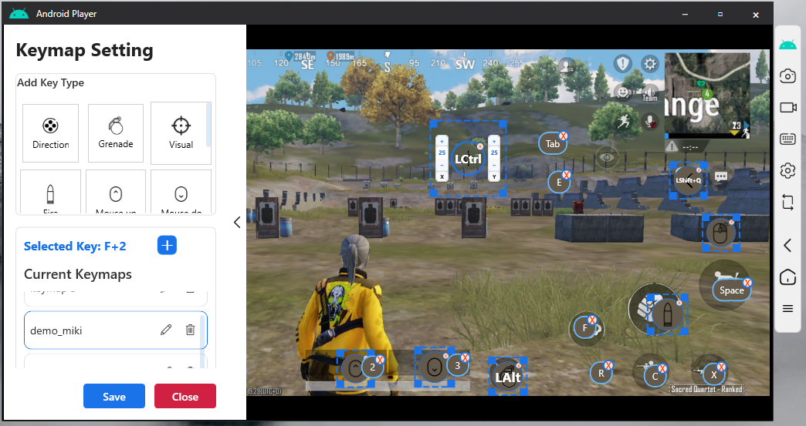

# AndroidPlayer

AndroidPlayer is a high-performance Android screen mirroring application for Windows built with Avalonia and DirectX. It provides low-latency video and audio streaming, keyboard and mouse control, and customizable key mapping for games and productivity.

> **Support for macOS and Linux is coming soon.**

---

## Features

- 🚀 Low-latency Android screen mirroring
- 🎮 Custom key mapping for games
- 🔊 Real-time Android audio forwarding
- ⌨️ Type directly on your Android device using your PC keyboard
- 🖱️ Mouse and keyboard control
- ⚡ GPU-accelerated H.264 decoding using FFmpeg
- 🖥️ DirectX rendering for smooth playback
- 📱 Works with Android devices over ADB

---

## Screenshots

### Screen Mirroring



### Key Mapping



---

## Building

### Requirements

- Windows 7 or later
- .NET SDK 8.0
- JetBrains Rider (recommended) or Visual Studio
- Android device with USB debugging enabled

### Build

Clone the repository:

```bash
git clone https://github.com/mikiboii/AndroidPlayer.git
```

Open the solution in **JetBrains Rider**:

```
Androidplayer.sln
```

Then either:

- Build and Run
- **or**
- Publish the project from Rider

No additional setup should be required if all project dependencies are present.

---

## Developer Mode

For easier testing while developing, enable Developer Mode inside the application.

Open:

```text
Androidplayer.Store.my_info
```

and set:

```csharp
private bool _developerMode = true;
```

Developer Mode enables features that simplify testing during development.

---

## Contributing

Contributions are welcome!

1. Fork the repository.
2. Create a new branch.
3. Make your changes.
4. Submit a Pull Request.

Please keep code style consistent and test changes before submitting.

---

## Technologies

- C#
- Avalonia UI
- DirectX 11
- FFmpeg.AutoGen
- ADB
- .NET


---

## 💝 Support the Project

If you find AndroidPlayer useful and would like to support its development, consider making a donation:

[](https://paypal.me/mikiyasweldetinsay21)

👉 **Donate here:** [https://paypal.me/mikiyasweldetinsay21](https://paypal.me/mikiyasweldetinsay21)

Your support helps keep the project alive and encourages continued development! Every contribution, no matter how small, is greatly appreciated. ❤️

---


## Credits & Acknowledgements

AndroidPlayer would not exist without the work of these projects:

- **[scrcpy](https://github.com/Genymobile/scrcpy)** by Genymobile — the original Android screen mirroring and control tool. AndroidPlayer's streaming model, `scrcpy-server.jar` integration, and much of the ADB control flow are directly inspired by (and in places rely on) scrcpy. Huge thanks to the scrcpy team and contributors.
- **[Flyleaf](https://github.com/SuRGeoNix/Flyleaf)** by SuRGeoNix — media playback framework whose architecture and media handling approach influenced parts of AndroidPlayer's FFmpeg integration.

Special thanks to the **scrcpy** and **Flyleaf** projects and their maintainers — please consider starring and supporting them:

- https://github.com/Genymobile/scrcpy
- https://github.com/SuRGeoNix/Flyleaf

---

## License

This project is licensed under the Apache 2.0 License.

See the `LICENSE` file for details.